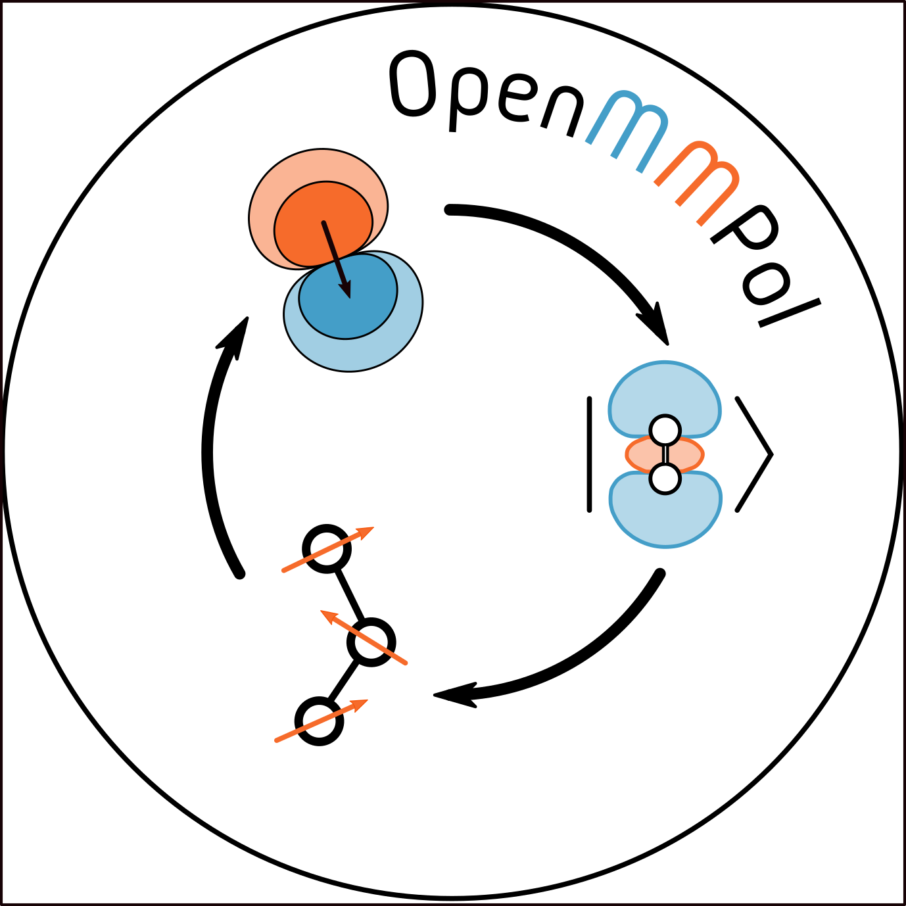

# Open-MMPol
## an open-source implementation of induced point-dipole polarizable embedding 

## Description
OpenMMPol is an open-source library to interface quantum chemical software with atomistic polarizable embedding. With OpenMMPol any quantum mechanical method that is able to provide the electrostatic potential, field, and field gradient for a given electronic density could be coupled to polarizable embedding with [AMOEBA](https://pubs.acs.org/doi/10.1021/jp910674d) (and other forcefield). Through simple interface functions, it allows to compute the QM/AMOEBA contribution to the energy and to the selected Hamiltonian. 

OpenMMPol also implements all the non-electrostatic terms of the MM force field (Van der Waals and bonded interactions). This allows the host code to compute the full potential for the embedded system. 

OpenMMPol is written in Fortran and is distributed with interfaces to C, Fortran and Python3. 

OpenMMPol is written and maintained by the MoLECoLab (Modeling Light & Environment in Complex Systems) research group at the University of Pisa (molecolab.dcci.unipi.it). 

## Documentation
Documentation is generated with [FORD](https://github.com/Fortran-FOSS-Programmers/ford) and is 
available at [project documentation page](https://molecolab-pisa.github.io/OpenMMPol)

## License 
OpenMMPol is free software, you can use it under the terms of the LGPL-3.0 License.

## Version and Releases
OpenMMPol is mantained as a git repository. For reproducibilty reasons we strongly encourage to build the library from a cloned repository.
OpenMMPol is versioned using [semantic versioning](https://semver.org/), a tag in the git repository is added for each version. At configure time a version identifier is hard-coded into the library and headers file. If the repo is not in a tagged commit, a suffix specifieng the number of commits from last tag, the last commit identifier and the state of the repository will be added to the version identifier.

A version identifier reads as ``<MAJOR>.<MINOR>.<PATCH>.r<N>.1234abc.dirty`` for a dirty repo at commit ``1234abc`` that is N commits beyond the ``<MAJOR>.<MINOR>.<PATCH>`` tag.

In non-git release the version identifier can be hard-coded in ``include/version.h`` using the preprocessor variable ``_OMMP_VERSION``:

``#define _OMMP_VERSION "0.1.2"``

## Citing OpenMMPol
Please cite the following papers if you use the library:

[The OpenMMPol library for polarizable QM/MM calculations of properties and dynamics](https://doi.org/10.1063/5.0198251)
M. Bondanza, T. Nottoli, M. Nottoli, L. Cupellini, F. Lipparini and B. Mennucci
J. Chem. Phys. 160, 134106 (2024)
doi:10.1063/5.0198251

[Polarizable embedding QM/MM: the future gold standard for complex (bio)systems?](https://doi.org/10.1039/D0CP02119A)
M. Bondanza, M. Nottoli, L. Cupellini, F. Lipparini and B. Mennucci
Phys. Chem. Chem. Phys. 22, 14433-14448 (2020)
doi:10.1039/D0CP02119A

[A QM/MM Approach Using the AMOEBA Polarizable Embedding: From Ground State Energies to Electronic Excitations](https://doi.org/10.1021/acs.jctc.6b00385)
J. Chem. Theory Comput. 12, 3654-3661 (2016)
D. Loco, É. Polack, S. Caprasecca, L. Lagardère, F. Lipparini, J.-P. Piquemal and B. Mennucci
doi:10.1021/acs.jctc.6b00385

## Contributions
### Core Developers
[Mattia Bondanza](https://orcid.org/0000-0001-6254-3957)

[Tommaso Nottoli](https://orcid.org/0000-0002-9543-6127)

[Michele Nottoli](https://orcid.org/0000-0002-6544-0897)

[Filippo Lipparini](https://orcid.org/0000-0002-4947-3912)

[Benedetta Mennucci](https://orcid.org/0000-0002-4394-0129)

### Community Contributions
[Alexander Maryewski](https://orcid.org/0000-0002-7390-1075) - Reviewed build system

## Dependencies and Quick Installation

To build and install the package, you just need a compiler that supports standard Fortran2008ts (currently the 
library is tested with `gnu 7.5.0`, `intel 2024.2.0` and `nvidia 24.5.1`), cmake >= 3.20, 
lapack, openSSL, openMP, cJSON libraries and optionally HDF5 library.

To install the requirements on OpenSuse Leap just use the following command:

``zypper in cJSON-devel gcc gcc-c++ gcc-fortran make cmake python lapack-devel liblapack3 hdf5 hdf5-devel zlib-devel``

To build the package, create a customized copy of ``config.cmake`` and edit it according to your needs:

``$ cp config.cmake custom.cmake``

Then just use cmake to build the project:

``$ cmake [-C custom.cmake] -B build``
  
``$ cmake --build build -j``

At configuration time you can control several build options:

``-DCMAKE_BUILD_TYPE=<Debug|Release|RelWithDebInfo|Coverage> # to control the compiler flags (debug generate a much slower code with a more strict control)``

``-CMAKE_INSTALL_PREFIX=<PATH_TO_INSTALL> # eg. / /usr /usr/local /home/user/.local etc.``

``-DTESTLANG=<C|F03> # Tests are run with the programs implemented in the selected language``
  
``-DCMAKE_C_COMPILER -DCMAKE_CXX_COMPILER -DCMAKE_Fortran_COMPILER # Compilers to be used; eg. to use intel/nvidia compilers instead of defaults``

And install it with:

``$ cmake --install build``

To compile the python module you need the pybind11 package and numpy; to install those
requirements on  OpenSuse Leap use:

``zypper in python-pybind11-common-devel python3-numpy python3-pybind11 python3-pybind11-devel``

To compile and install the python packge, enable python in your cmake configuration (eg. editing config.cmake).
Then build the program as before: the make install package will also install the python package in your current
python directory. If you want to install just the Python package and skip all the other parts of installation, use the
following installation command:

``cmake --install <NAME-OF-BUILD-DIRECTORY> --component Python``

You can also build Python packages (after installing build package) using:

``make PythonPackage``

from the build directory; this will generate the ``.tar.gz`` and ``.whl`` packages in ``pythonapi/dist``.
