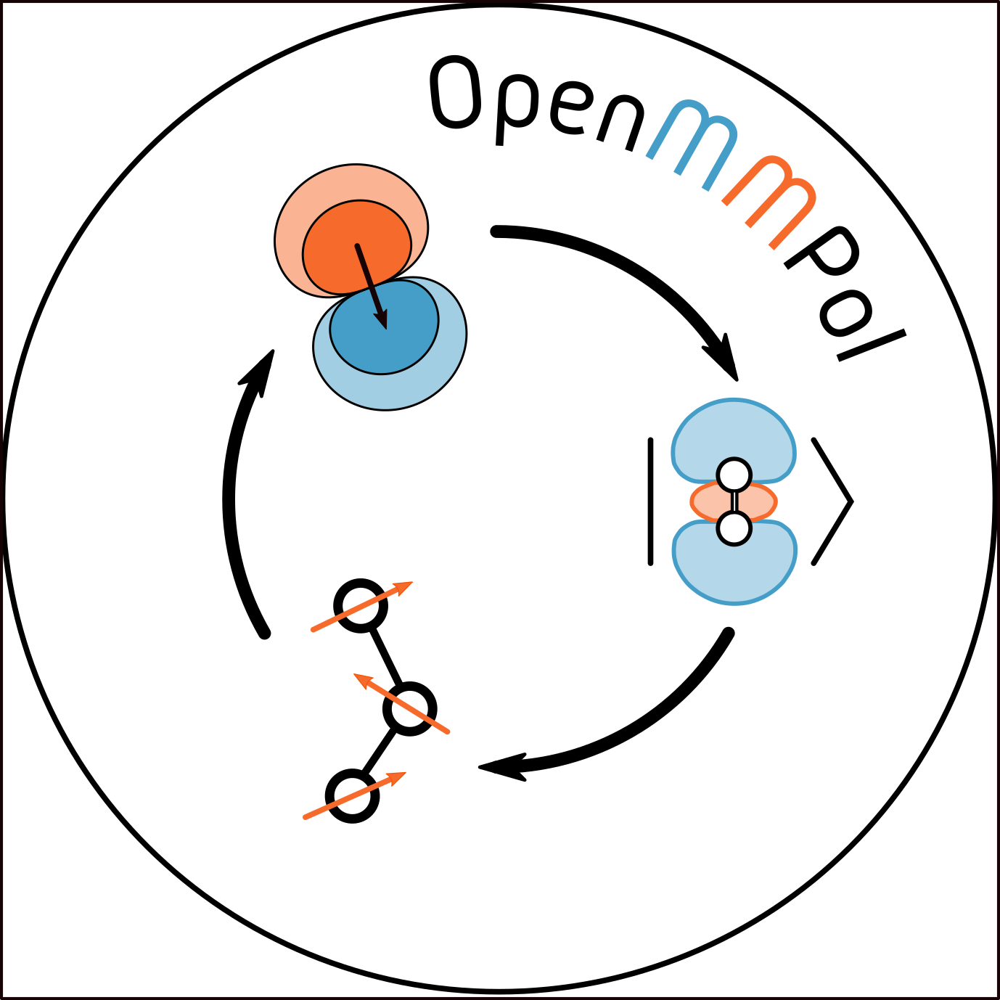

<div align="center">

# Open-MMPol
## an open-source implementation of induced point-dipole polarizable embedding 

</div>

## Description
OpenMMPol is an open-source library to interface quantum chemical software with atomistic polarizable embedding. With OpenMMPol any quantum mechanical method that is able to provide the electrostatic potential, field, and field gradient for a given electronic density can be coupled to polarizable embedding with [AMOEBA](https://pubs.acs.org/doi/10.1021/jp910674d) (and other force fields). Through simple interface functions, it allows computing the QM/MM contribution to the energy and to the selected Hamiltonian.

OpenMMPol also implements all the non-electrostatic terms of the MM force field (Van der Waals and bonded interactions). This allows the host code to compute the full potential for the embedded system.

OpenMMPol is written in Fortran and distributed with interfaces to C, Fortran and Python3 (via pybind11).

OpenMMPol is written and maintained by the [MoLECoLab](https://molecolab.dcci.unipi.it) (Modeling Light & Environment in Complex Systems) research group at the University of Pisa .

## Documentation

A detailed user guide covering installation, input formats, and usage of OpenMMPol is provided in:
- **[User Guide](docs/user_guide.md)** — installation, JSON interface, OMMP-IP, MMP format, and troubleshooting.

Code documentation (Fortran API) is generated with [FORD](https://github.com/Fortran-FOSS-Programmers/ford) and is available at:
- **[API Docs](https://molecolab-pisa.github.io/OpenMMPol)**

Additional resources:
- **[Tinker format reference](https://dasher.wustl.edu/tinker/)** — for `.xyz` and `.prm` file formats

## Structure

```
OpenMMPol/
├── app/          # Code for ommp_pp and ommp_xyz2mmp utilities
├── cmake/        # cmake build functions
├── config/       # files that are modified at configuration time by cmake
├── docs/         # User guide and other documentation
├── include/      # Include file for C/C++ interfaces and Fortran preprocessing
├── logo/         # Graphic sources for the logo
├── pythonapi/    # Python bindings (pyopenmmpol) and python utils (ommp-ip.py)
├── src/          # Core Fortran library
├── tests/        # Test programs in C and Fortran and test inputs
├── toolchain/    # cmake definition of different build systems
├── config.cmake  # Example CMake configuration
└── README.md     # This file
```

## License
OpenMMPol is free software, distributed under the terms of the [LGPL-3.0 License](https://www.gnu.org/licenses/lgpl-3.0).

## Version and Releases
OpenMMPol is maintained as a git repository. For reproducibility reasons we strongly encourage building the library from a cloned repository.

OpenMMPol is versioned using [semantic versioning](https://semver.org/), with a git tag added for each version. At configure time a version identifier is hard-coded into the library and header files. If the repo is not in a tagged commit, a suffix specifying the number of commits from the last tag, the last commit identifier and the state of the repository will be appended.

A version identifier reads as `<MAJOR>.<MINOR>.<PATCH>.r<N>.1234abc.dirty` for a dirty repo at commit `1234abc` that is N commits beyond the `<MAJOR>.<MINOR>.<PATCH>` tag.

In non-git releases the version identifier can be hard-coded in `include/version.h` using the preprocessor variable `_OMMP_VERSION`:

```
#define _OMMP_VERSION "1.1.4"
```

## Citing OpenMMPol
Please cite the following papers if you use the library:

[The OpenMMPol library for polarizable QM/MM calculations of properties and dynamics](https://doi.org/10.1063/5.0198251)
M. Bondanza, T. Nottoli, M. Nottoli, L. Cupellini, F. Lipparini and B. Mennucci
J. Chem. Phys. 160, 134106 (2024)
doi:10.1063/5.0198251

[Polarizable embedding QM/MM: the future gold standard for complex (bio)systems?](https://doi.org/10.1039/D0CP02119A)
M. Bondanza, M. Nottoli, L. Cupellini, F. Lipparini and B. Mennucci
Phys. Chem. Chem. Phys. 22, 14433-14448 (2020)
doi:10.1039/D0CP02119A

[A QM/MM Approach Using the AMOEBA Polarizable Embedding: From Ground State Energies to Electronic Excitations](https://doi.org/10.1021/acs.jctc.6b00385)
J. Chem. Theory Comput. 12, 3654-3661 (2016)
D. Loco, É. Polack, S. Caprasecca, L. Lagardère, F. Lipparini, J.-P. Piquemal and B. Mennucci
doi:10.1021/acs.jctc.6b00385


## Contributions
### Core Developers
[Mattia Bondanza](https://orcid.org/0000-0001-6254-3957)

[Tommaso Nottoli](https://orcid.org/0000-0002-9543-6127)

[Michele Nottoli](https://orcid.org/0000-0002-6544-0897)

[Filippo Lipparini](https://orcid.org/0000-0002-4947-3912)

[Benedetta Mennucci](https://orcid.org/0000-0002-4394-0129)

### Community Contributions
[Alexander Maryewski](https://orcid.org/0000-0002-7390-1075) - Reviewed build system
